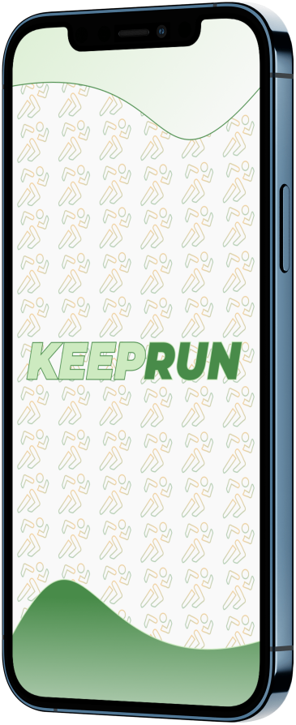
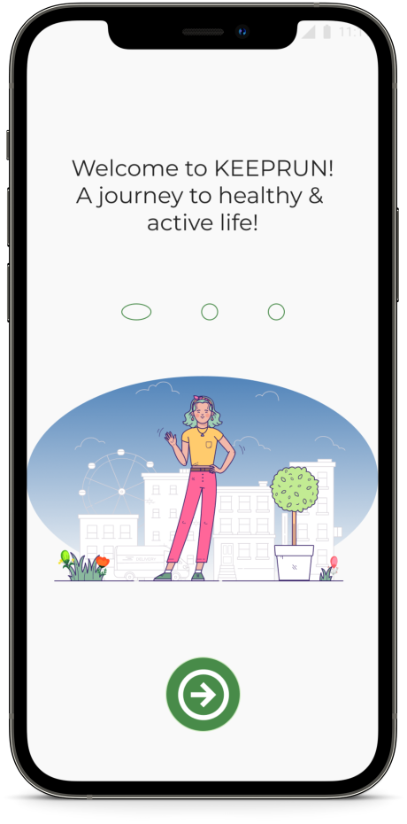
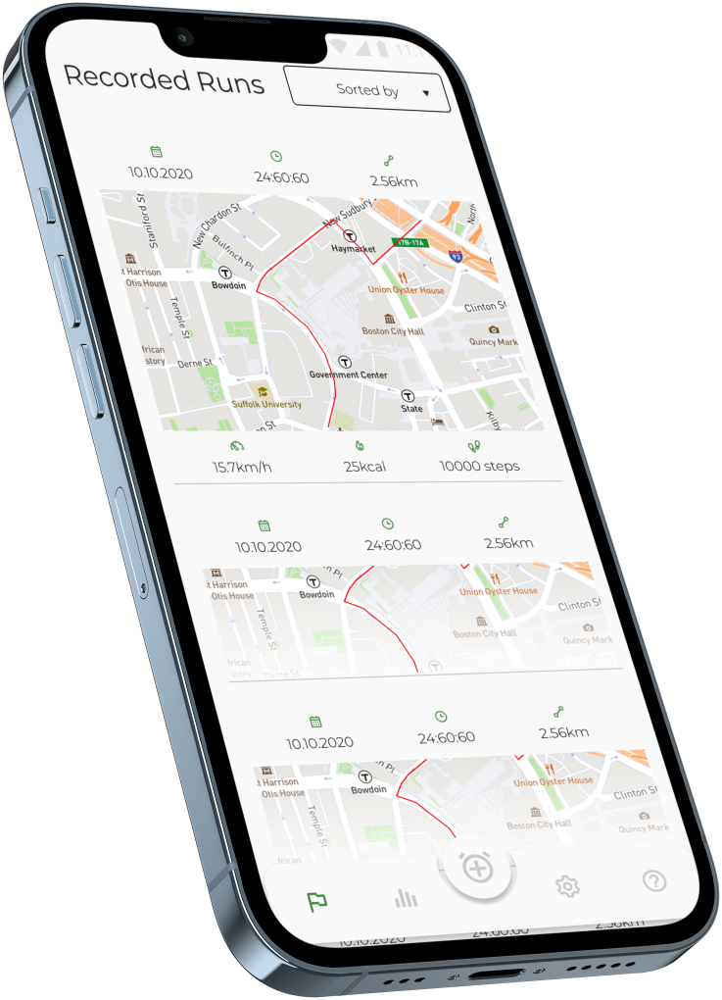
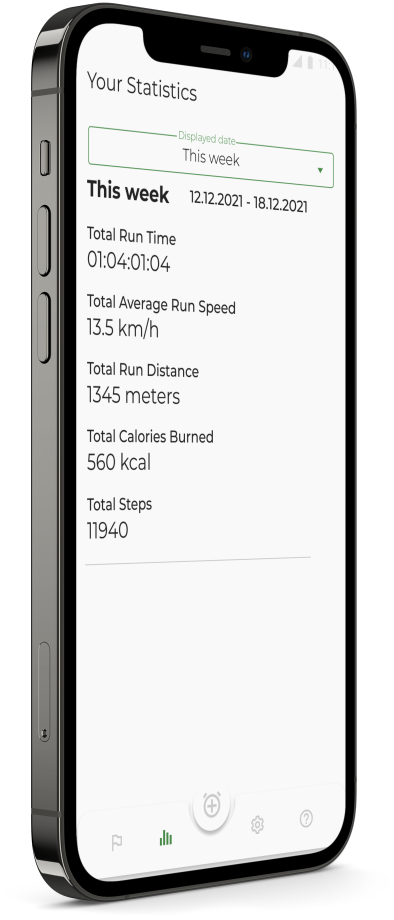
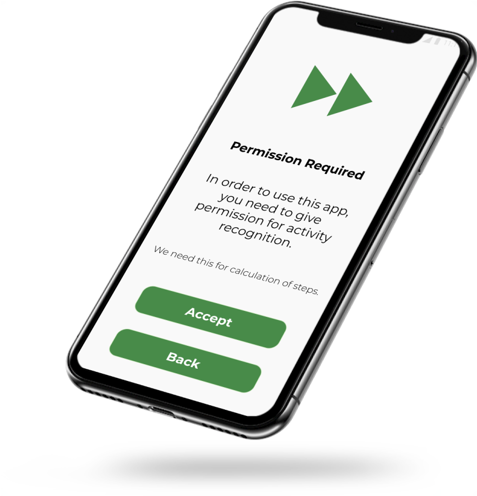
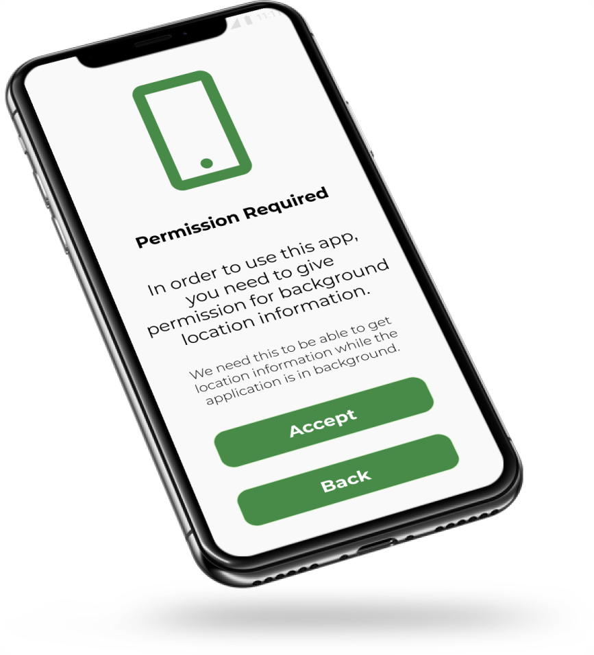
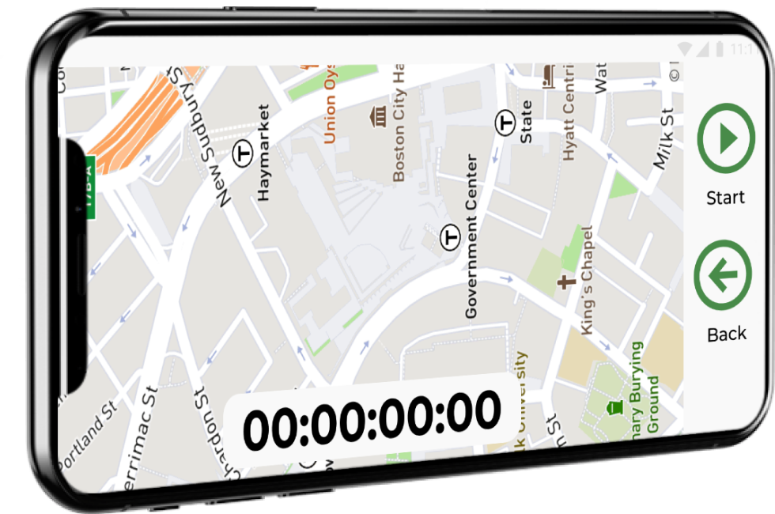
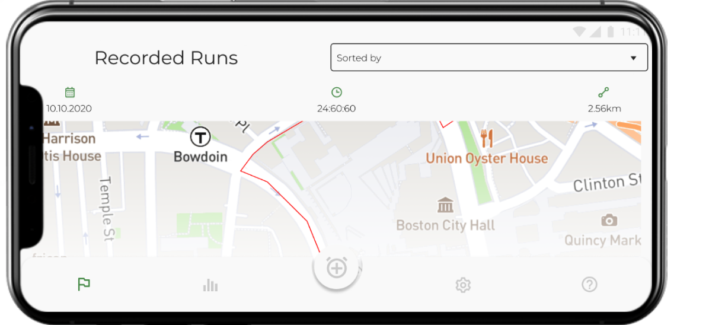
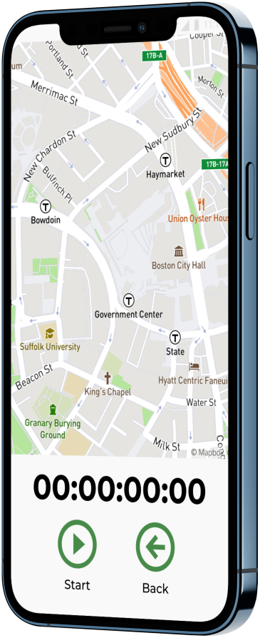
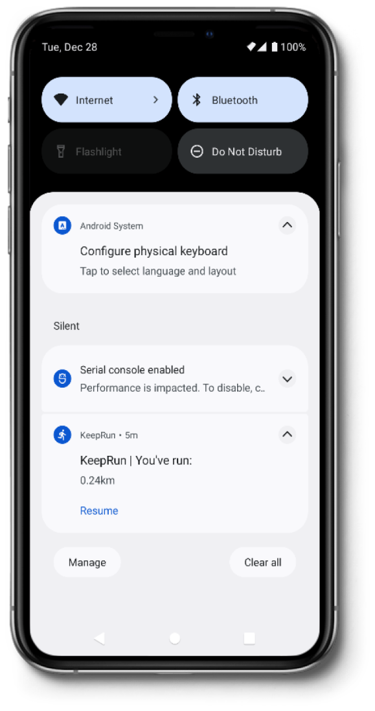

# KeepRun
KeepRun, a run analysis application that was developed for Android mobile devices to support getting in the habit of running as a healthy activity. Users can track their running/jogging speeds, running distance, calories burned, step count, and route taken via a map interface.

### Used Technologies and Libraries
* Clean Architecture & MVVM
* Kotlin
* Kotlin Coroutines
* Google Maps API
* Dagger Hilt
* Jetpack Components ( Navigation, Room, DataStore, LiveData, Lifecycle, ViewModel )
* Firebase services ( Authentication, Realtime Database, Storage, Cloud Messaging )

### Screens

#### The application welcomes you with a splash screen and onboarding screens

#### You can preview previous runs with more general informations. Once you click a run element, it expands and shows detailed analysis information. Detailed statistics can also be shown in Statistics Tab in text fashion.

#### All permissions requested once they are necessary with an explanation.

#### After all necessary permissions are granted, you are all set to run! You can use either in portrait mode or landscape more. Even in background with a notification that shows how the distance you run.

